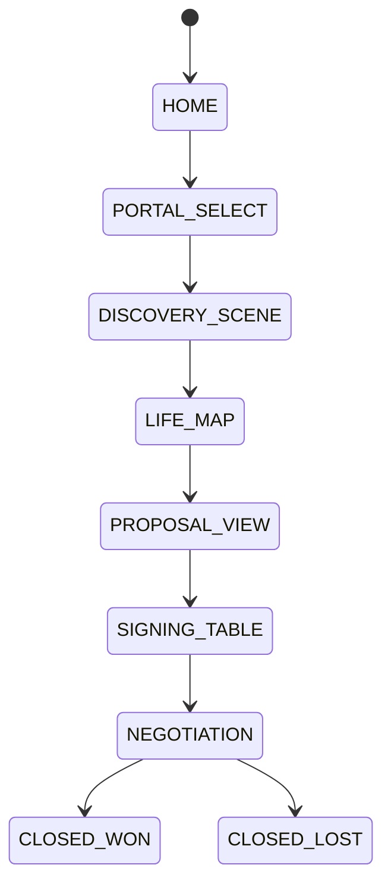

# Cinematic Commerce - Estados e Transicoes (Rodobens Wealth)

## Objetivo
Modelar a jornada como estados explicitos, onde o usuario constroi decisoes e o sistema registra a verdade.

## Estados (alto nivel)
1. HOME
2. PORTAL_SELECT (Casa | Carro | Familia)
3. DISCOVERY_SCENE (perguntas minimas; sem formulario)
4. LIFE_MAP (verdade estruturada; persistida no Deal)
5. PROPOSAL_VIEW (Essential | Wealth | Legacy)
6. SIGNING_TABLE (confirmacoes ativas)
7. NEGOTIATION (deal governado)
8. CLOSED_WON / CLOSED_LOST

## Eventos canonicos
- EVT_INGEST_RECEIVED
- EVT_LIFE_MAP_ATTACHED
- EVT_PROPOSALS_GENERATED
- EVT_PROPOSAL_ACCEPTED
- EVT_STAGE_CHANGED

## Checkpoints de Verdade
- LIFE_MAP: persistido (versionado)
- PROPOSALS: persistidas (versionadas)
- ACCEPTANCE: snapshot forense (imutavel)

## Transicoes (resumo)
- HOME -> PORTAL_SELECT (user intent)
- PORTAL_SELECT -> DISCOVERY_SCENE (scene start)
- DISCOVERY_SCENE -> LIFE_MAP (truth capture)
- LIFE_MAP -> PROPOSAL_VIEW (engine)
- PROPOSAL_VIEW -> SIGNING_TABLE (user commitment)
- SIGNING_TABLE -> NEGOTIATION (acceptance recorded)
- NEGOTIATION -> CLOSED_* (operational close)

## Diagrama (Mermaid)

